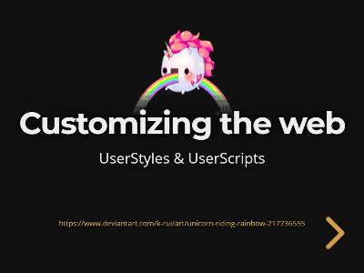

## Presentations

A Presentation (more to come) I've been working on for lightning talks.

## View

There are two ways to view the presentations:

### Install [`reveal-md`](https://github.com/webpro/reveal-md)

- Install reveal-md globally: `npm install -g reveal-md`
- Open the presentation subfolder in the terminal (e.g. `cd presentations/customizing-the-web`)
- Initialize: `reveal-md PITCHME.md`

### Open with [GitPitch](https://gitpitch.com/)

Click on the thumbnail to start the presentation

|   |
|:-:|
|  |
