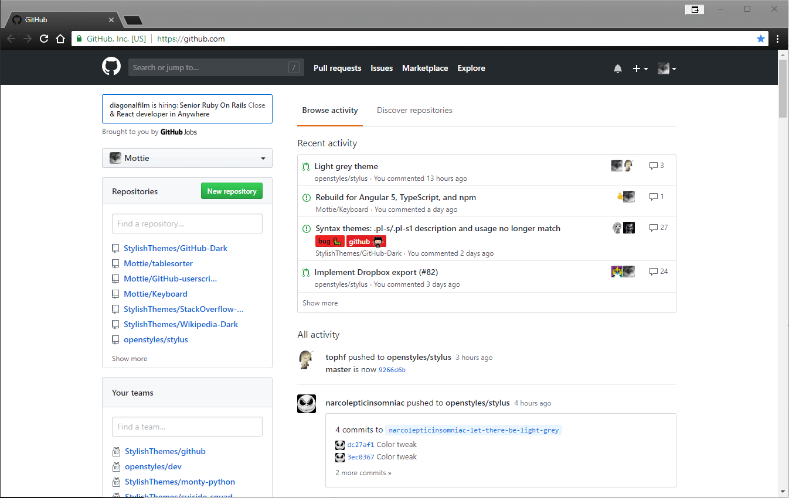
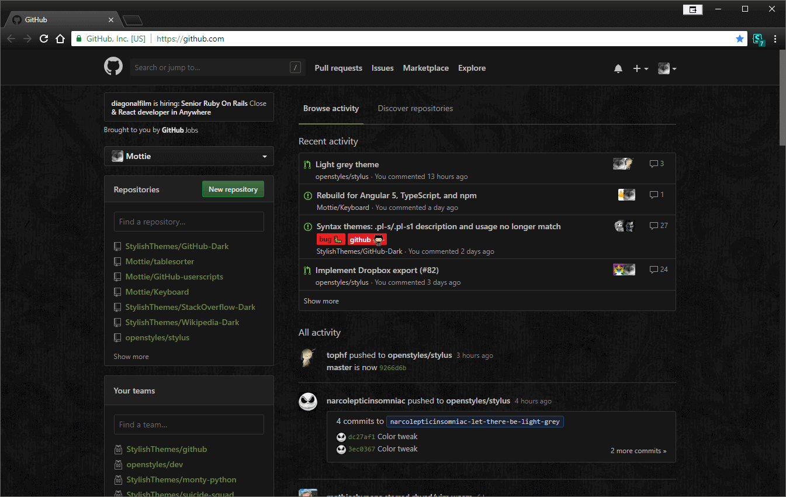
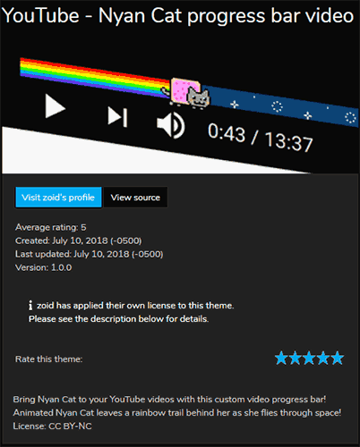
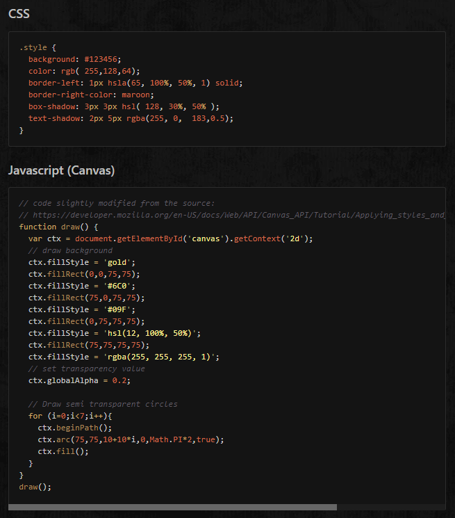
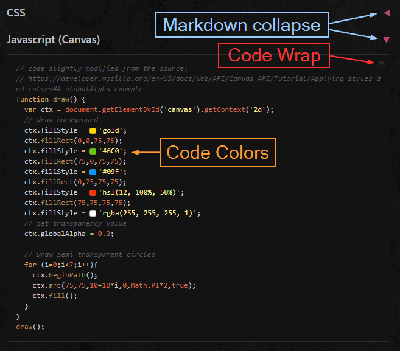
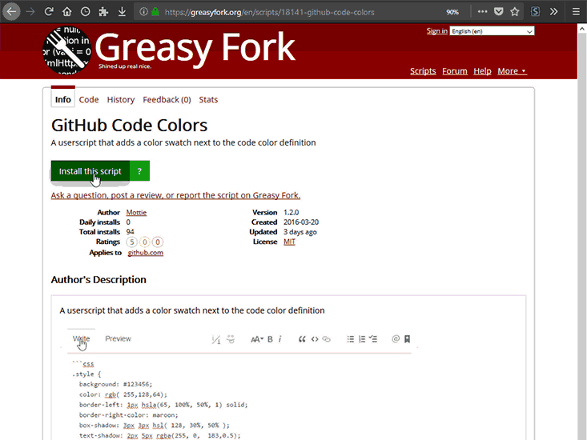

<!-- .slide: data-background="url(images/unicorn_riding_rainbow_by_k_rui-d3lmuln.gif) no-repeat center 10%" -->

<style>
/* First slide */
#customizing-the-web { margin-top: 150px; }
.reveal .backgrounds .slide-background:first-child { background-size: 30% auto !important; }
.reveal h2, .reveal p, .reveal a { text-shadow:1px 1px 2px #000, 0 0 1em #000, 0 0 0.2em #000; }
.reveal a.smallest { font-size:.5em; bottom: -100px; }
/* rest of the slides */
.reveal section img { background: transparent; border-color: #333; }
.reveal table tbody th { width: 50%; text-align: center; font-size: 30px; border-color: #333; }
.reveal table tbody td { width: 50%; text-align: center; vertical-align: top; line-height: .4em; }
.line-through.visible { text-decoration: line-through; }
.reveal strong { color: #555; font-size: .7em; }
</style>

## Customizing the web

UserStyles & UserScripts

<a href="https://www.deviantart.com/k-rui/art/unicorn-riding-rainbow-217736555" class="smallest">https://www.deviantart.com/k-rui/art/unicorn-riding-rainbow-217736555</a>

---
<!-- .slide: data-background="#222" -->

## UserStyles

- What? Injected CSS
- Why? Change stuff
- How? UserStyle manager

Note: hide ads, change theme or move elements

---

### UserStyle CSS

```css
@-moz-document domain("foo.com"), regexp("^https?://bar\\.com$") {
  body {
    background: #111 !important;
    color: #ddd !important;
  }
  #site-ads {
    display: none !important;
  }
}
```

<small>https://developer.mozilla.org/en-US/docs/Web/CSS/@document</small>

Note: @document has been deprecated

---

### UserCSS (CSS/Stylus)

```css
/* ==UserStyle==
@name        My UserStyle
@version     v0.0.1
@description Make everything rainbows!
@namespace   github.com/me
@author      Me
@license     CC-BY-SA-4.0
@var         color bkgd-color 'Background color' #111
==/UserStyle== */
@-moz-document domain("foo.com"), regexp("^https?://bar\\.com$") {
  body {
    background-color: var(--bkgd-color) !important;
    background-image: url(https://my-site/rainbow.png) !important;
  }
}
```

```css
:root { --bkgd-color: #111 } /* <-- injected & based on user choice */
```

---

<!-- .slide: data-background="#222" -->

### GitHub-Dark UserStyle

| Before | After |
|:------:|:-----:|
|  |  |

---

#### GitHub-Dark UserCSS Settings


---

### UserStyles Managers


<ul>
  <li>
    <span>Stylish (2005)</span> <!-- .element: class="fragment highlight-red line-through" data-fragment-index="6" -->
  </li> <!-- .element: class="fragment" data-fragment-index="1" -->
  <li><a href="https://add0n.com/stylus.html">Stylus</a> (Jan 2017)</li> <!-- .element: class="fragment" data-fragment-index="2" -->
  <li><a href="https://github.com/FirefoxBar/xStyle">xStyle</a> (Feb 2017)</li> <!-- .element: class="fragment" data-fragment-index="3" -->
  <li><a href="https://cascadea.app/">Cascadea</a> (Safari only; Oct 2018)</li> <!-- .element: class="fragment" data-fragment-index="4"> -->
  <li><a href="https://add0n.com/stylus.html">Stylus</a> (Webkit-based Edge, through Chrome web store)</li> <!-- .element: class="fragment" data-fragment-index="5"> -->
</ul>

Note: Stylish sold to SimilarWeb Jan 2017

---

### UserStyle Storehouses

<ul>
  <li>
    <a href="https://userstyles.org">
      <span>Userstyles.org</span> <!-- .element: class="fragment highlight-red line-through" data-fragment-index="1" -->
    </a>
  </li>
  <li><a href="https://33kk.github.io/uso-archive/">USO-archive</a> (archive of Userstyles.org)</li>
  <li><a href="https://freestyler.ws/">FreeStyler.ws</a></li>
  <li>Anywhere (UserCSS only)</li>
</ul>

Note: userstyles.org by Stylish author, also sold to SimilarWeb Jan 2017

---



<small>https://openusercss.org/theme/5b44efdce6b5730b0032f83f</small>

---

## UserScripts

- What? Injected JavaScript
- Why? Change stuff
- How? UserScript manager

---

#### UserScript (JavaScript)

```js
// ==UserScript==
// @name        My Userscript
// @version     0.0.1
// @description Try to take over the world!
// @namespace   github.com/me
// @author      Me
// @match       https://www.google.com
// @grant       none
// ==/UserScript==
(function() {
  'use strict';
  // Your code here...
})();
```

---

#### GitHub UserScripts

<table>
<tr>
  <th>Before</th>
  <th>After</th>
</tr>
<tr>
  <td></td>
  <td>
    
    <a href="https://greasyfork.org/en/scripts/20974" style="font-size:14px; color: #91C0F0;">https://greasyfork.org/en/scripts/20974</a>
    <a href="https://greasyfork.org/en/scripts/18789" style="font-size:14px; color: #FF3230;">https://greasyfork.org/en/scripts/18789</a>
    <a href="https://greasyfork.org/en/scripts/18141" style="font-size:14px; color: #FB9632;">https://greasyfork.org/en/scripts/18141</a>
  </td>
</tr>
</table>

---

### UserScript Managers


- [Greasemonkey](https://www.greasespot.net/) (Firefox only)
- [Tampermonkey](https://tampermonkey.net/)

---

### UserScript Storehouses

- [GreasyFork.org](https://greasyfork.org)
- [OpenUserJS.org](https://openuserjs.org)
- Anywhere (GitHub, GitLab, Bitbucket, etc)

Note: GreasyFork.org also by Stylish author, not sold

---

### GitHub Custom Navigation

Before 
After  

<small>https://greasyfork.org/en/scripts/20830</small>

---

### Quick Review

1. Install manager.
2. Go to a storehouse.
3. Search by site name.

---

#### UserStyle


---

#### UserScript



---

#### Rob Garrison


&#x00ab;w&#x006f;wm&#111;&#x0074;&#116;y&#x40;&#103;m&#x0061;il&#46;c&#111;m&#187;
<br>
[github.com/Mottie](https://github.com/Mottie)
